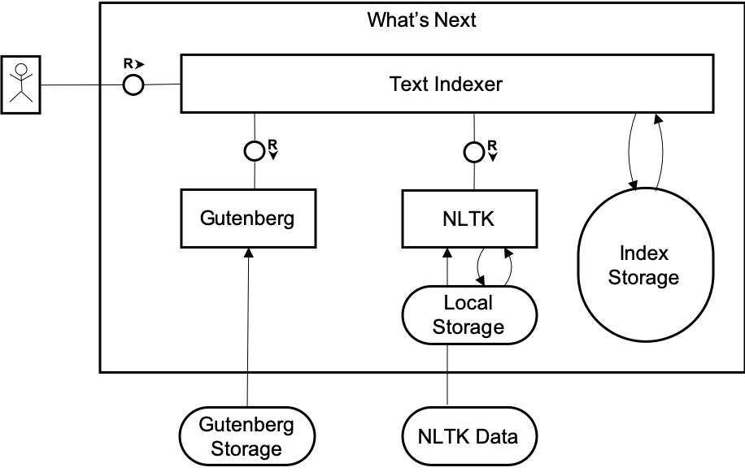
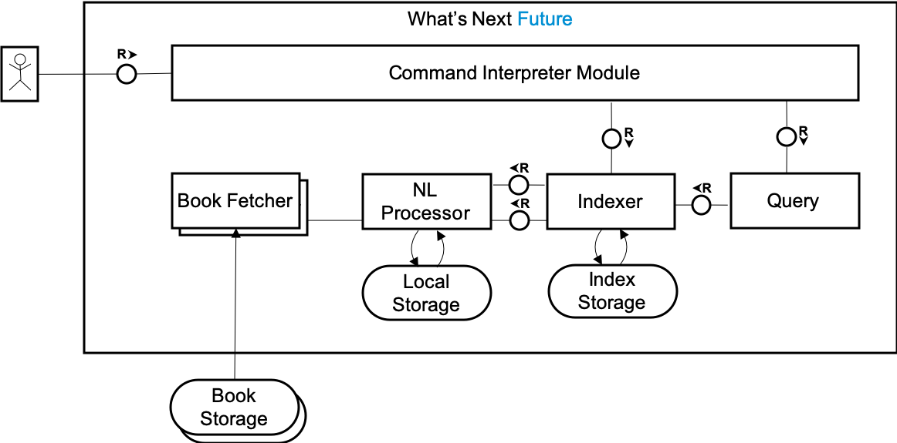

# What's Next in Python

[whats_next](whats_next.py) is a small Python program to search [Project Gutenberg books](http://www.gutenberg.org/).

Currently is supports word suggestion based on a set of books.

```sh
$ python3 whats_next.py --help
usage: whats_next.py [-h] --book-id BOOK_IDS [BOOK_IDS ...] --query QUERY
                     [QUERY ...]

Word suggestion based on Project Gutenberg books.

optional arguments:
  -h, --help            show this help message and exit
  --book-id BOOK_IDS [BOOK_IDS ...]
                        the book id of the Project Gutenberg
  --query QUERY [QUERY ...]
                        suggest next word for list of string
```

You might be interested into running it with [Docker](http://docker.com/) in case you have.

## Running with Docker

This section requires Docker. To install it look [here](https://docs.docker.com/install/).


A prebuilt container is available [here](https://hub.docker.com/repository/docker/whatsnextquestion/wnq), to execute it run:

```sh
$ docker run whatsnextquestion/wnq:latest

Unable to find image 'whatsnextquestion/wnq:latest' locally
latest: Pulling from whatsnextquestion/wnq
Digest: sha256:34c26d22a524b7083991d86bb608262d0645c2d81651a14b37a3d190fc5a1dda
Status: Downloaded newer image for whatsnextquestion/wnq:latest
usage: whats_next.py [-h] --book-id BOOK_IDS [BOOK_IDS ...] --query QUERY
                     [QUERY ...]
whats_next.py: error: the following arguments are required: --book-id, --query
```

To query something real do:
```sh
$ docker run whatsnextquestion/wnq:latest --book-id 46 --query god bless
['us']
```

So obviously good fortune is ahead!

## Running on OSX

The installation on Mac OSX is straight forward:

```sh
brew install berkeley-db4

pip3 install -r requirements.txt

python3 -m nltk.downloader punkt
```

## Design

This is really a small program. It is also quite humble, look at the pydoc at [whats_next.py](whats_next.py). It has been developed in just 6, documented in a few more.

It consists modules depicted on the following diagram.



*The diagram uses TAM notation. For more information check [this guide](http://www.fmc-modeling.org/fmc-and-tam).*

The major building blocks are described bellow. 

### Text Indexer

This is the main component of the program. It can be found here: [text_indexer.py](text_indexer.py). It supports:
  * adding texts
  * querying for suggestions.

The text is separated into sentences using [NLTK](https://nltk.org). NLTK is a natural language toolkit (hence the acronym), that is used instead of implementing own algorithm. Natural language detection is a hard problem, the most intuitive approach to look for stops (.), esclamation marks (!), question marks(?) will not give good results over a wide input set such as the Project Gutenberg Books. Even if this is extened to support abbreviations, language idioms, this continues to be a hard problem, and will produce low quality in the suggested words. 

Even with NLTK and the current design the results are not satisfactory, but is answering exactly the question in the problem '... and outputs the word that appears most frequently right after the provided N words...'. There is too much about languagre support - for example, to suggest a word, the program needs to understand the context and the semantics of the text. The analysis is done always in the context of a sentences, so let's focus only on the commas (,) that might appear there - it can be used to enumerate adjectives in an additive manner "Blue, red, green and cia are the colors on the painting.", so here if we query for "blue red", then semantically "green" is a good suggestion. In the same time the comma (,) can be used to separate different parts of the sentence, so if we ask for the current sentence what is the suggested word after sentence, we should get only "what", and not "so" and "we". The last two sentences were examples of quite complicated sentences that can be constructed and might eventually appear in Project Gutenberg books.

Currently indexes are not stored, however they can be easily stored in JSON format.

### Gutenberg

This is module that is directly reused from the community that supports download of Project Gutenberg books and metadata. This functionality is reused because there exists a more mature implementation that satisfies the scenario and is a good fit.

### NLTK

NLTK is a leading platform for building Python programs to work with human language data. It provides easy-to-use interfaces to over 50 corpora and lexical resources such as WordNet, along with a suite of text processing libraries for classification, tokenization, stemming, tagging, parsing, and semantic reasoning, wrappers for industrial-strength NLP libraries, and an active discussion forum.

## Future

Using Python was great to bootstrap fast the project, however for a fast project we need a better language. 

[Python code performance decreases with threading.](https://stackoverflow.com/questions/6821477/python-code-performance-decreases-with-threading)

One of the possible futures is to use GoLang, another Java. Work has already been started for GoLang [here](https://github.com/whatsnextquestion/whats-next-go). Java also looks promissing because of [Apache's Open NLP](https://opennlp.apache.org/). No matter in which direction we go the architecture of the program will look like:



Here each box represent a component, which can be owned by separate teams, with proper interfaces, similar to the ones from the Pythons Gutenberg and NLTK libraries. The command intepreter and the indexer / query engine relations are a bit different. There will be an extension point to add easily new book fetchers, hence multiple book fetcher agents are shown. With such interface points the 5 components can be build in parallel. 

## Development

[VS Code](https://code.visualstudio.com/) can be used for light development environment. Launch configurations are added [here](.vscode/launch.json).

[PyLint](https://pylint.org) is used to ensure code style
```sh
$ pylint *.py

--------------------------------------------------------------------
Your code has been rated at 10.00/10 (previous run: 10.00/10, +0.00)
```

Before commiting the pull request will be validated, to not regress the pylint score.

[Python unit testing framework](https://docs.python.org/3/library/unittest.html) is used for developing units.
```sh
$ python3 *test.py

...
----------------------------------------------------------------------
Ran 3 tests in 0.015s

OK
```

Before commiting the pull request will be validated, to not regress the unit tests is made. Code coverage is not currently measured but it will be soon.

### Bulding Images

The docker images can be produced with the following commands:

```sh
docker login # supply username and password

docker build -t whatsnextquestion/wnq:latest .
docker push whatsnextquestion/wnq:latest
```

## Development Documentation

To access the developer documentation run:

```sh
pydoc -p 8080 # substitude 8080 if want to view the documentation under another port
```

To stop the server type 'q' and press enter.

Open http://localhost:8080 to view the documentation. This link will not be valid if you have changed the pydoc port.

You can look for the 'whats-next-python' module or directly jump to:
   * [whats_next](http://localhost:8080/whats_next.html)
   * [text_indexer](http://localhost:8080/text_indexer.html)
   * [argparse_validators](http://localhost:8080/argparse_validators.html)
   * [text_indexer_test](http://localhost:8080/text_indexer_test.html)

## TODO

[Add code coverage](https://coverage.readthedocs.io/en/v4.5.x/)